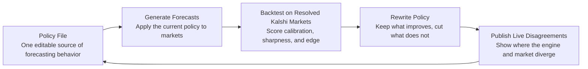

# autoedge

<p align="center">
  <strong>A self-improving forecasting engine that edits one policy file, backtests itself on resolved Kalshi markets, and publishes live disagreements with the market.</strong>
</p>

<p align="center">
  
  
  
</p>

---

## What It Does

`autoedge` treats forecasting like a closed-loop system:

- It keeps its reasoning concentrated in a single policy file.
- It rewrites that policy as new evidence comes in.
- It scores those changes against resolved Kalshi markets.
- It ships the current edge by surfacing where its forecast diverges from the market.

That makes the engine legible, testable, and forced to improve against reality instead of vibes.

## The Loop



## Why The Design Is Different

| Conventional setup | autoedge |
| --- | --- |
| Logic scattered across prompts, scripts, and operator intuition | One policy file acts as the system of record |
| Improvement is anecdotal | Improvement is measured on resolved markets |
| Live calls are hard to audit | Disagreements with the market are explicit and inspectable |
| Research and deployment drift apart | Backtesting and publishing sit inside the same loop |

## Core Principles

### 1. One File Matters
The engine does not hide its judgment policy across a pile of moving parts. If behavior changes, the policy file changed.

### 2. Reality Is The Evaluator
Every iteration gets pulled back to resolved Kalshi outcomes. The system earns the right to keep a change by performing better in backtests.

### 3. Edge Should Be Public
The useful output is not a vague confidence score. It is the live set of places where the engine disagrees with the market and is willing to be measured.

## Conceptual Architecture

```text
          historical markets                live markets
                 |                              |
                 v                              v
        +------------------+          +------------------+
        | backtest runner  |          | forecast runner  |
        +------------------+          +------------------+
                 |                              |
                 +-------------+  +-------------+
                               v  v
                         +-------------+
                         | policy file |
                         +-------------+
                               |
                               v
                     +---------------------+
                     | policy editor loop  |
                     +---------------------+
                               |
                               v
                     +---------------------+
                     | published edge feed |
                     +---------------------+
```

## In One Sentence

> `autoedge` is a forecasting engine that continuously rewrites a single policy, proves those edits against resolved markets, and exposes its live edge where it disagrees with Kalshi.

## North Star

Build a forecasting system that can answer three questions at any point in time:

1. What policy produced this forecast?
2. Did that policy actually work on resolved markets?
3. Where does it currently disagree with the market enough to matter?
