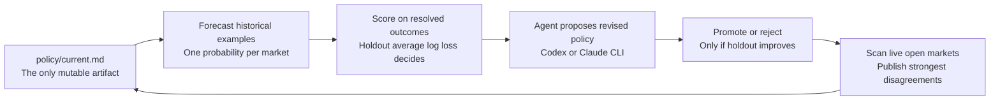

# autoedge

<p align="center">
  <strong>A self-improving forecasting engine that edits one policy file, backtests itself on resolved Kalshi markets, and publishes live disagreements with the market.</strong>
</p>

<p align="center">
  
  
  
</p>

---

## Thesis

`autoedge` applies the autoresearch pattern to prediction markets.

The repo is not a trading bot. It does not place orders, manage capital, or optimize for short-term PnL. It is a forecasting research harness with one changing surface: [`policy/current.md`](./policy/current.md).

Everything else stays fixed:

- Kalshi ingestion and normalization
- 24-hour historical snapshot selection
- chronological train/holdout split
- log-loss scoring
- experiment ledgers and reports
- live disagreement publishing

That is the point. The policy is forced to improve its judgment inside a frozen evaluator.

## The Loop



## Why It Is Small

The visual heart of the repo is the experiment history.

Every run produces:

- a policy hash
- a holdout score
- a baseline market score
- a promotion or rejection decision

Over time, that history answers the only question that matters: is the policy actually getting better at assigning probabilities?

## Repo Shape

```text
policy/current.md          # only mutable forecasting policy
src/                       # frozen harness code
test/                      # normalization, scoring, and workflow tests
artifacts/cache/           # synced Kalshi snapshots + cutoff cache
artifacts/ledgers/         # append-only experiment, live, and policy ledgers
artifacts/policies/        # archived policy versions by content hash
artifacts/reports/         # generated markdown + SVG outputs
artifacts/splits/          # frozen chronological split manifest
```

## Harness Modules

- `src/cli.ts`: command entrypoint for `sync`, `backtest`, `improve`, `publish`, and `report`
- `src/workflows.ts`: orchestration for the full research loop plus summary formatting
- `src/kalshi.ts`: Kalshi ingestion, normalization, and 24-hour snapshot extraction
- `src/agent.ts`: local `codex` or `claude` runner for forecasting and policy revision
- `src/scoring.ts`: log-loss scoring plus training error summaries
- `src/splits.ts`: chronological train/holdout manifest generation and selection
- `src/storage.ts`: cache, ledger, report, and policy archive I/O
- `src/report.ts`: Markdown and SVG report generation
- `src/types.ts` and `src/utils.ts`: shared data contracts and helper utilities

## Generated Files

```text
artifacts/cache/historical-cutoff.json   # optional Kalshi historical cutoff marker
artifacts/cache/resolved-examples.json   # resolved markets with frozen 24h snapshots
artifacts/cache/open-markets.json        # latest open-market snapshot set
artifacts/ledgers/experiments.jsonl      # append-only backtest + improve runs
artifacts/ledgers/live.jsonl             # append-only live predictions and resolutions
artifacts/ledgers/policies.jsonl         # archived policy metadata by content hash
artifacts/reports/experiment-history.md  # generated experiment history report
artifacts/reports/live-disagreements.md  # generated live disagreement report
artifacts/reports/experiment-trend.svg   # generated holdout trend chart
artifacts/splits/resolved-split.json     # frozen chronological train/holdout assignment
```

## Runtime

The forecasting and revision steps run through a local agent CLI, not direct model API calls.

Supported runners:

- `codex`
- `claude`

Default behavior is `AUTOEDGE_AGENT_CLI=auto`, which prefers `codex` when available and otherwise falls back to `claude`.

Useful environment variables:

```bash
AUTOEDGE_ARTIFACTS_DIR=artifacts
AUTOEDGE_AGENT_CLI=auto
AUTOEDGE_AGENT_MODEL=
AUTOEDGE_AGENT_REVISION_MODEL=
AUTOEDGE_AGENT_TIMEOUT_MS=120000
AUTOEDGE_FORECAST_CONCURRENCY=1
AUTOEDGE_SYNC_CONCURRENCY=1
AUTOEDGE_RESOLVED_LIMIT=200
AUTOEDGE_OPEN_LIMIT=100
AUTOEDGE_PUBLISH_MIN_DELTA=0.1
AUTOEDGE_PUBLISH_TOP_N=20
KALSHI_BASE_URL=https://api.elections.kalshi.com/trade-api/v2
KALSHI_EXTRA_HEADERS_JSON={}
```

## Commands

```bash
npm install
npm test
npm run sync
npm run backtest -- --split holdout
npm run improve
npm run publish
npm run report
```

What each command does:

- `test`: runs the Vitest suite for Kalshi normalization, scoring, and workflow invariants
- `sync`: fetches resolved and open Kalshi markets, normalizes them, and freezes the split manifest on first run
- `backtest`: evaluates the active policy on `train`, `holdout`, or `all` and appends a backtest run to the experiment ledger
- `improve`: scores the current policy on train plus holdout, archives one candidate policy, and promotes it only if holdout log loss strictly improves
- `publish`: scores current open markets, appends live predictions, and backfills newly resolved outcomes for previously published calls
- `report`: regenerates experiment-history Markdown, live Markdown, and the SVG trend chart from the current ledgers

## Evaluation Rules

- Historical truth source: resolved binary Kalshi markets
- One historical example per market: latest 60-minute candlestick ending at or before 24 hours before settlement
- Deciding metric: holdout average log loss
- Promotion rule: candidate policy must beat the active policy on holdout log loss
- Live metrics are secondary diagnostics and never decide promotion

## Outputs

The repo always aims to answer three questions:

1. What policy made this prediction?
2. How did that policy score on resolved markets?
3. Where does it currently disagree with the market?

Those answers live in generated artifacts:

- `artifacts/cache/historical-cutoff.json`
- `artifacts/cache/resolved-examples.json`
- `artifacts/cache/open-markets.json`
- `artifacts/splits/resolved-split.json`
- `artifacts/ledgers/experiments.jsonl`
- `artifacts/ledgers/live.jsonl`
- `artifacts/ledgers/policies.jsonl`
- `artifacts/reports/experiment-history.md`
- `artifacts/reports/live-disagreements.md`
- `artifacts/reports/experiment-trend.svg`

## Not In V1

- wallet management
- order placement
- routing
- shadow execution as the optimization target
- multi-agent orchestration

Future paper trading or live execution can sit on top of the same snapshot and forecast ledgers later, but the v1 repo is intentionally read-only.
